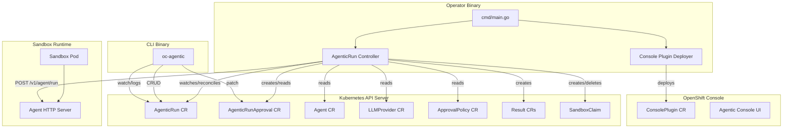
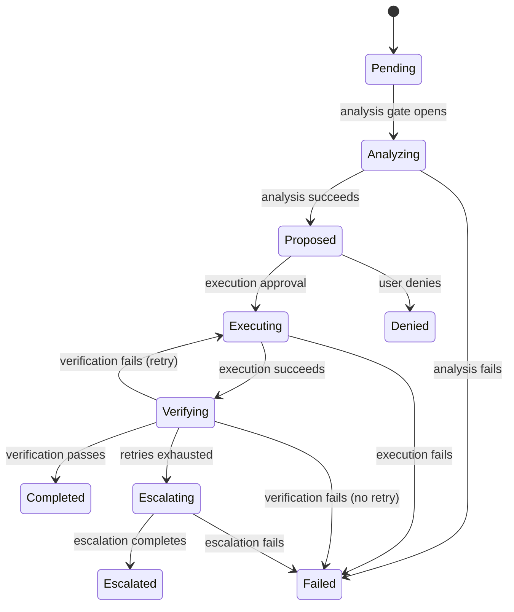
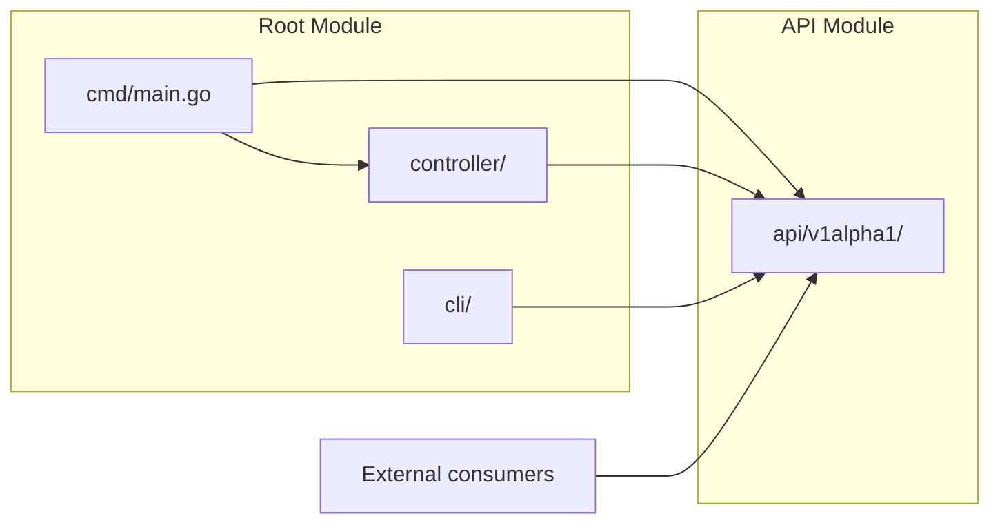
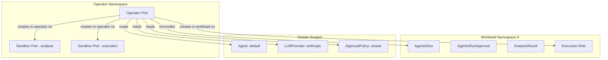

# Architecture

The lightspeed-agentic-operator is a Kubernetes operator built with controller-runtime that orchestrates AI-assisted change proposals on OpenShift clusters. It watches `AgenticRun` custom resources and drives each through a multi-phase workflow -- analysis, execution, and verification -- with configurable human approval gates between phases. Each phase invokes an LLM-backed agent running inside an ephemeral sandbox pod.

## System Components

## AgenticRun Data Flow

A `AgenticRun` moves through phases driven by conditions on its status. The phase is derived (never stored) from the condition set using `DerivePhase()`.

Each step (analysis, execution, verification, escalation) follows the same pattern:

1. Check approval gate (automatic or manual via `AgenticRunApproval`)
2. Ensure a derived `SandboxTemplate` with LLM credentials and tools
3. Create a `SandboxClaim` to provision an ephemeral sandbox pod
4. Wait for sandbox readiness (`Ready=True` condition)
5. `POST /v1/agent/run` with step-specific query and output schema
6. Record the result in a typed Result CR (`AnalysisResult`, `ExecutionResult`, etc.)
7. Update proposal conditions and status

## Module Organization

The codebase splits into two Go modules:

- **Root module** (`go.mod`) -- the operator binary, CLI binary, controller logic, and all runtime dependencies. Uses `replace => ./api` for local development.
- **API module** (`api/go.mod`) -- CRD type definitions only. Published separately so downstream projects (console, CLI, other operators) can import types without pulling in controller-runtime or other operator dependencies.

## Deployment Topology

The operator runs as a single-replica Deployment in a designated namespace (e.g., `openshift-lightspeed`). Sandbox pods also run in this namespace, not in tenant namespaces. AgenticRuns are namespace-scoped and created in workload namespaces.

## Key Architectural Decisions

**Condition-driven state machine.** AgenticRun phase is derived from `status.conditions` via a pure function (`DerivePhase`), not stored as a separate field. This ensures the phase label is always consistent with the actual condition state and can be recomputed by any consumer (controller, CLI, console) without drift.

**Sandbox isolation.** Each workflow step runs in an ephemeral sandbox pod provisioned through the Sandbox API (`SandboxClaim` / `SandboxTemplate`). The operator creates derived templates by cloning a base template and patching in LLM credentials, tools, and step configuration. Templates are named by content hash for deduplication.

**Dual approval model.** `ApprovalPolicy` (cluster singleton) defines default automatic/manual gates. `AgenticRunApproval` (per-proposal) carries user decisions, option selection, and agent overrides. The combined gate function checks both: a step is approved if the policy says `Automatic` OR the approval has a non-denied entry.

**Create-only idempotency.** Child resources (AgenticRunApproval, Result CRs, RBAC objects) use `Create` + handle `AlreadyExists` rather than `Get`-then-`Create`, avoiding read-modify-write race conditions.

**Separate API module.** The `api/` directory is its own Go module so downstream projects can depend on CRD types without importing controller-runtime or the full operator dependency tree.
